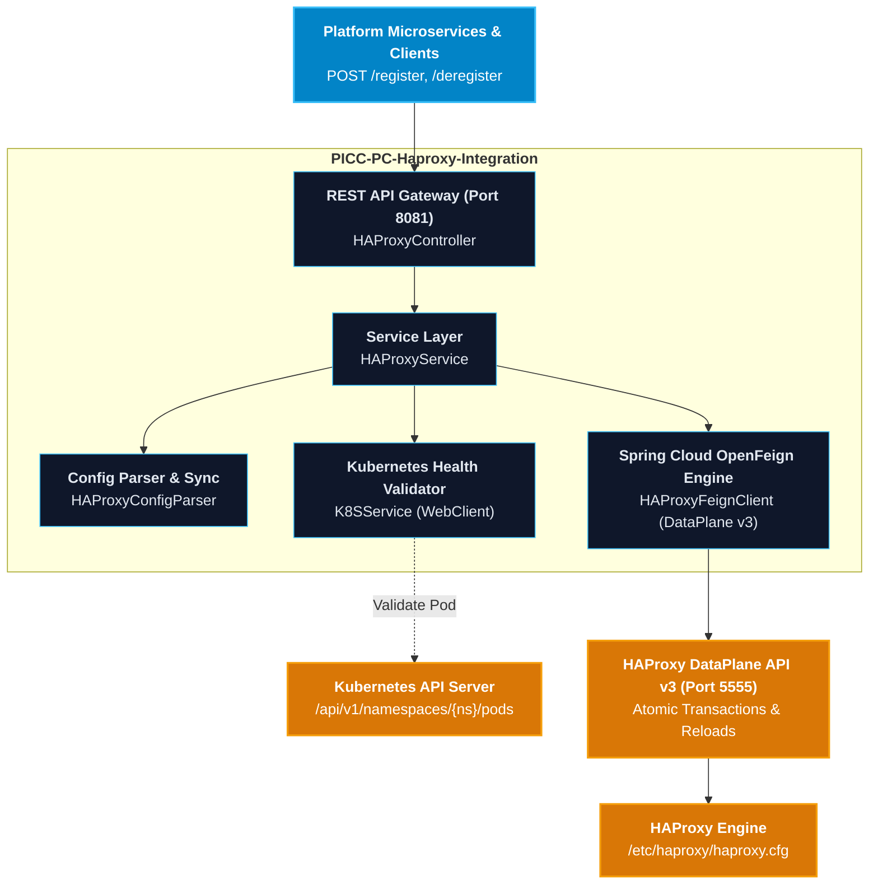

# PICC-PC-Haproxy-Integration

[](https://openjdk.org/projects/jdk/21/)
[](https://spring.io/projects/spring-boot)
[](https://spring.io/projects/spring-cloud)
[](https://www.haproxy.com/documentation/dataplaneapi/community-v3/)
[](LICENSE)
[]()

Enterprise HAProxy DataPlane API v3 integration microservice providing automated service registration, multi-pattern backend routing, atomic transactional configuration updates, on-disk drift reconciliation, and asynchronous reload orchestration across the **Platform Infrastructure and Core Components (PICC)** suite of the **Nubo Native Platform (NNP)**.

---

## Table of Contents

- [Overview](#overview)
- [Key Architectural Features](#key-architectural-features)
- [Architecture and Ecosystem](#architecture-and-ecosystem)
- [Technology Matrix](#technology-matrix)
- [Quick Start](#quick-start)
  - [Prerequisites](#prerequisites)
  - [Configuration](#configuration)
  - [Local Execution](#local-execution)
  - [Docker Container Execution](#docker-container-execution)
- [REST API Capabilities](#rest-api-capabilities)
- [Supported Backend Patterns](#supported-backend-patterns)
- [Project Documentation](#project-documentation)
- [Repository Structure](#repository-structure)
- [Security and Vulnerability Management](#security-and-vulnerability-management)
- [Contributing](#contributing)
- [License](#license)

---

## Overview

**`PICC-PC-Haproxy-Integration`** provides a declarative, transactional integration gateway between platform microservices and the **HAProxy DataPlane API v3**. It abstracts low-level HAProxy configuration primitives into unified REST endpoints, enabling dynamic service registration, upstream SSL offloading, URL path rewriting, WebSocket/SSE timeouts, and automated zero-downtime reloads.

Inheriting from the platform's standardized BOM ([`PICC-PC-Abstract-NNP-Platform`](https://github.com/Nubo-Native-Platform/PICC-PC-Abstract-NNP-Platform)), `PICC-PC-Haproxy-Integration` enforces Java 21 LTS runtime standards, Spring Cloud OpenFeign patterns, and automated DevSecOps compliance scanning.

---

## Key Architectural Features

- **Declarative RPC Integration**: Powered by **Spring Cloud OpenFeign** with basic authentication interceptors and custom error decoders for the HAProxy DataPlane API v3.
- **Atomic Transactional Safety**: All configuration mutations (backend, server, ACL, and use_backend rules) are staged within atomic DataPlane API transactions with automatic rollback on error.
- **Two-Way Configuration Reconciliation**: Protects on-disk `/etc/haproxy/haproxy.cfg` file edits against accidental overwrite by re-importing live configurations into the DataPlane API model before staging.
- **Asynchronous Non-Blocking Execution**: High-throughput service registrations run asynchronously via `CompletableFuture`, returning `202 ACCEPTED` with pollable status endpoints.
- **Kubernetes Pod Status Validation**: Optional pre-registration validation that queries the Kubernetes API (`/api/v1/namespaces/{namespace}/pods`) to verify container health before traffic routing.
- **Multi-Pattern Backend Support**: Native orchestration for `K8S_DNS`, `EXTERNAL_IP`, `SSL`, `PATH_REWRITE`, `WEBSOCKET`, `TIME_CONFIGURABLE`, and `TCP` modes.
- **DevSecOps Security Pipeline**:
  - **SAST**: SpotBugs + FindSecBugs security rules (`spotbugs-exclude.xml`).
  - **SCA**: OWASP Dependency-Check enforcing zero CVSS >= 7.0 vulnerabilities.
  - **SBOM**: CycloneDX plugin generating immutable Software Bill of Materials (`bom.json`).

---

## Architecture and Ecosystem



---

## Technology Matrix

| Category | Component / Library | Version | Role / Description |
| :--- | :--- | :--- | :--- |
| **Runtime** | Java JDK | `21` (LTS) | Long-Term Support Java runtime environment |
| **Parent BOM** | `abstract-nnp` | `1.0.0` | Standardized enterprise parent and dependency governance |
| **Framework** | `spring-boot-starter-web` | `3.5.4` | Enterprise microservice application framework |
| **Cloud / RPC** | `spring-cloud-starter-openfeign` | `2025.0.0` | Declarative HTTP client for HAProxy DataPlane API v3 |
| **Reactive Web**| `spring-boot-starter-webflux` | Managed | Non-blocking WebClient for Kubernetes API queries |
| **Documentation** | `springdoc-openapi` | `2.8.5` | OpenAPI 3.0 specification and Swagger UI |
| **Security SAST**| `spotbugs-maven-plugin` | `4.8.6.0` | Static byte-code security analysis |
| **SCA / CVE** | `dependency-check-maven` | `10.0.4` | OWASP vulnerability composition scanner |
| **SBOM** | `cyclonedx-maven-plugin` | `2.9.1` | Software Bill of Materials (CycloneDX 1.5 JSON) |

---

## Quick Start

### Prerequisites

- **JDK 21** installed and configured (`JAVA_HOME`).
- **Maven 3.9+** (or use the included `./mvnw`).
- **HAProxy 2.8+** with **DataPlane API v3** accessible via HTTP.

### Configuration

Copy the template `.env.example` to create your local `.env`:

```bash
cp .env.example .env
```

Configure the connection variables:

```properties
SERVER_PORT=8081
HAPROXY_DATAPLANE_URL=http://localhost:5555
HAPROXY_DATAPLANE_USER=dataplaneapi
HAPROXY_DATAPLANE_PASSWORD=yourSecretDataPlanePassword
HAPROXY_K8S_VALIDATION_ENABLED=false
```

### Local Execution

```bash
# Compile and run unit tests
./mvnw clean test

# Run microservice locally
./mvnw spring-boot:run
```

The service will start on port `8081`:
- **Swagger UI**: [http://localhost:8081/swagger-ui.html](http://localhost:8081/swagger-ui.html)
- **OpenAPI JSON Spec**: [http://localhost:8081/v3/api-docs](http://localhost:8081/v3/api-docs)
- **Health Endpoint**: [http://localhost:8081/health](http://localhost:8081/health)

### Docker Container Execution

```bash
# Build production Docker image
docker build -t picc-pc-haproxy-integration:latest .

# Run container with environment configuration
docker run -d \
  --name haproxy-integration \
  -p 8081:8081 \
  --env-file .env \
  picc-pc-haproxy-integration:latest
```

Alternatively, use Docker Compose:

```bash
docker compose up -d
```

---

## REST API Capabilities

| HTTP Verb | Path | Description | Response Codes |
| :--- | :--- | :--- | :--- |
| `POST` | `/register` | Asynchronously register a service route and reload HAProxy | `202 ACCEPTED`, `400 BAD_REQUEST` |
| `GET` | `/register-status/{compName}` | Query the asynchronous registration status for a service | `200 OK`, `404 NOT_FOUND` |
| `POST` | `/deregister` | Asynchronously remove backend, server, ACL, and switching rules | `202 ACCEPTED`, `400 BAD_REQUEST` |
| `POST` | `/sync` | Reconcile on-disk `haproxy.cfg` file changes with DataPlane model | `200 OK`, `500 INTERNAL_ERROR` |
| `POST` | `/reload` | Trigger an immediate reload of HAProxy via DataPlane API | `200 OK`, `500 INTERNAL_ERROR` |
| `GET` | `/health` | Liveness and readiness diagnostic check | `200 OK` |

---

## Supported Backend Patterns

```bash
# 1. Standard Kubernetes In-Cluster Service (K8S_DNS)
curl -X POST http://localhost:8081/register \
  -H "Content-Type: application/json" \
  -d '{
    "compName": "order-service",
    "namespace": "default",
    "internalPort": 8080,
    "domain": "orders.example.com",
    "parentFE": "http_front",
    "backendType": "K8S_DNS"
  }'

# 2. External IP / NodePort / VM (EXTERNAL_IP)
curl -X POST http://localhost:8081/register \
  -H "Content-Type: application/json" \
  -d '{
    "compName": "dms-service",
    "serverAddress": "192.0.2.10",
    "serverPort": 9001,
    "domain": "dms.example.com",
    "parentFE": "http_front",
    "backendType": "EXTERNAL_IP"
  }'

# 3. Path Rewriting Backend (PATH_REWRITE)
curl -X POST http://localhost:8081/register \
  -H "Content-Type: application/json" \
  -d '{
    "compName": "gateway",
    "namespace": "default",
    "internalPort": 8080,
    "domain": "api.example.com",
    "parentFE": "http_front",
    "backendType": "PATH_REWRITE",
    "pathPrefix": "/api",
    "pathReplacement": "/v1/\\2"
  }'
```

---

## Project Documentation

Detailed architecture, developer guides, and operational runbooks:

- [**Development Guidelines & Contribution Standards**](DEVELOPMENT_GUIDELINES.md) — Architecture, coding rules, transaction patterns, SAST/SCA tooling, PR checklist.
- [**User Manual & Deployment Guide**](USER_MANUAL_AND_DEPLOYMENT_GUIDE.md) — Production operations, Kubernetes deployment manifests, routing patterns, troubleshooting.
- [**Security Policy**](SECURITY.md) — Vulnerability reporting and zero-secrets policy.
- [**Contributing Guide**](CONTRIBUTING.md) — Contribution steps, community workflow, and contact guidelines.
- [**Code of Conduct**](CODE_OF_CONDUCT.md) — CNCF Community Code of Conduct.
- [**Maintainers**](MAINTAINERS.md) — Core maintainers and contact points.

---

## Repository Structure

```
PICC-PC-Haproxy-Integration/
├── .github/
│   └── workflows/
│       └── ci-cd.yml                   # Automated CI/CD pipeline (GitHub Actions)
├── src/
│   ├── main/
│   │   ├── java/com/nnp/haproxy/
│   │   │   ├── config/                 # OpenFeign, OpenAPI, and WebClient configurations
│   │   │   ├── controller/             # REST API Controllers (/register, /deregister, /sync)
│   │   │   ├── exception/              # Global Exception Handlers
│   │   │   ├── feign/                  # HAProxy DataPlane API v3 Feign Client & Models
│   │   │   ├── model/                  # Request/Response DTOs & BackendType enum
│   │   │   ├── service/                # HAProxy orchestration & K8s pod validator
│   │   │   └── HaproxyIntegrationApplication.java
│   │   └── resources/
│   │       ├── application.properties  # Centralized environment variable properties
│   │       ├── application-dev.properties
│   │       └── application-main.properties
│   └── test/
│       └── java/com/nnp/haproxy/       # Comprehensive unit and mock integration test suite
├── .env.example                        # Environment variable configuration template
├── .gitattributes                      # Git line ending normalization
├── .gitignore                          # Ignore rules for secrets, builds, and IDE files
├── docker-compose.yml                  # Local multi-container development composition
├── Dockerfile                          # Multi-platform unprivileged container build
├── pom.xml                             # Maven build configuration & security plugins
├── spotbugs-exclude.xml                # SpotBugs SAST exclusion filters
├── CODE_OF_CONDUCT.md                  # CNCF Code of Conduct
├── CONTRIBUTING.md                     # Contribution guidelines
├── DEVELOPMENT_GUIDELINES.md           # Architecture & coding standards
├── LICENSE                             # Apache License 2.0
├── MAINTAINERS.md                      # Project maintainers
├── README.md                           # Project overview & quick start
├── SECURITY.md                         # Security vulnerability disclosure
└── USER_MANUAL_AND_DEPLOYMENT_GUIDE.md # Operational and deployment manual
```

---

## Security and Vulnerability Management

This repository adheres to a zero-trust credential model:
- **No Secrets**: Tokens, passwords, private keys, and `.env` files must never be committed.
- **Automated Scans**: Every PR and push executes **SpotBugs** SAST, **OWASP Dependency-Check** SCA, and **CycloneDX** SBOM generation.
- **Reporting Vulnerabilities**: Email **contribution@nubons.com** with details. Do not open public issues for security disclosures.

---

## Contributing

We welcome contributions from the community under the **Apache 2.0 License**!
1. Review [CONTRIBUTING.md](CONTRIBUTING.md) and [DEVELOPMENT_GUIDELINES.md](DEVELOPMENT_GUIDELINES.md).
2. Create a topic branch: `git checkout -b feature/my-feature`.
3. Submit a PR against `main` ensuring all tests pass (`./mvnw clean test`).

---

## License

This project is licensed under the **Apache License 2.0** — see the [LICENSE](LICENSE) file for details.
