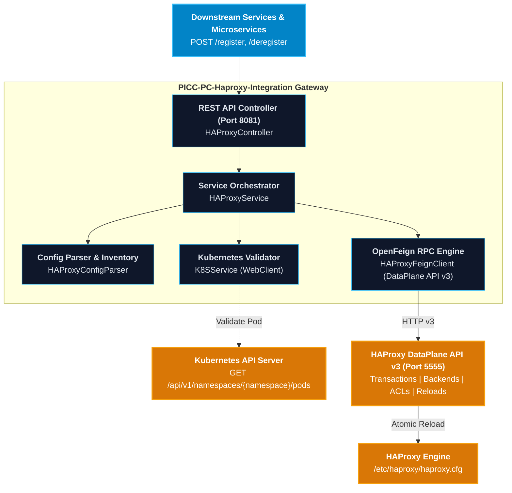

# User Manual and Deployment Guide: `PICC-PC-Haproxy-Integration`

This document provides a comprehensive operational and deployment manual for the **`PICC-PC-Haproxy-Integration`** microservice within the **Nubo Native Platform (NNP)**. It covers configuration, operational workflows, routing patterns, containerization, production deployment on Kubernetes, and troubleshooting.

---

## Table of Contents

1. [Service Architecture & Role](#1-service-architecture--role)
2. [Prerequisites & System Requirements](#2-prerequisites--system-requirements)
3. [Configuration Reference & Profiles](#3-configuration-reference--profiles)
   - [Application Properties Matrix](#application-properties-matrix)
   - [Configuration Profiles](#configuration-profiles)
   - [Centralized Config Server Integration](#centralized-config-server-integration)
4. [Functional Operations & Routing Patterns](#4-functional-operations--routing-patterns)
   - [Supported Backend Types](#supported-backend-types)
   - [Pre-Registration Kubernetes Validation](#pre-registration-kubernetes-validation)
   - [Transactional Safety & Reload Synchronization](#transactional-safety--reload-synchronization)
   - [Two-Way Configuration Sync & Reconciliation](#two-way-configuration-sync--reconciliation)
   - [REST API Endpoints Reference & Examples](#rest-api-endpoints-reference--examples)
5. [Local Build & Containerization](#5-local-build--containerization)
   - [Local Build with Maven](#local-build-with-maven)
   - [Docker Container Build & Execution](#docker-container-build--execution)
   - [Docker Compose Multi-Container Setup](#docker-compose-multi-container-setup)
6. [Production Deployment on Kubernetes](#6-production-deployment-on-kubernetes)
   - [Kubernetes Deployment & Service Manifest](#kubernetes-deployment--service-manifest)
   - [Automated Deployment Pipelines](#automated-deployment-pipelines)
7. [Troubleshooting & Frequently Asked Questions](#7-troubleshooting--frequently-asked-questions)

---

## 1. Service Architecture & Role

`PICC-PC-Haproxy-Integration` dynamically orchestrates ingress routing rules in **HAProxy** using the official **HAProxy DataPlane API v3**. It automates backend creation, server registration, ACL domain matching, HTTP switching rules, and reload execution.



---

## 2. Prerequisites & System Requirements

| Requirement | Minimum Version | Recommended Version | Details |
| :--- | :--- | :--- | :--- |
| **Java Development Kit** | JDK 21 | Eclipse Temurin 21 (LTS) | Baseline runtime target |
| **Build Tool** | Maven 3.9.0+ | Maven 3.9.6+ | Maven Wrapper (`./mvnw`) included |
| **Parent Platform** | `abstract-nnp:1.0.0` | `abstract-nnp:1.0.0` | Standardized BOM dependency management |
| **HAProxy Engine** | HAProxy 2.8+ | HAProxy 2.9+ / 3.0 | Target load balancer |
| **DataPlane API** | DataPlane API v3.0+ | DataPlane API v3.x | Must have HTTP basic authentication enabled |
| **Kubernetes API** | v1.24+ | v1.28+ | Optional, for pre-registration pod validation |
| **Container Engine** | Docker 20.10+ | Docker Engine 24+ / Podman | For containerized execution |
| **Memory / CPU** | 512 MB RAM / 0.5 CPU | 1 GB RAM / 1.0 CPU | Typical production footprint |

---

## 3. Configuration Reference & Profiles

### Application Properties Matrix

All configuration parameters can be supplied via `application.properties` or overridden via environment variables:

| Property Key | Environment Variable | Default Value | Description |
| :--- | :--- | :--- | :--- |
| `server.port` | `SERVER_PORT` | `8081` | Microservice HTTP listening port |
| `spring.application.name` | - | `haproxy-int` | Application service name |
| `spring.profiles.active` | `SPRING_PROFILES_ACTIVE` | `main` | Active environment profile (`dev`, `main`) |
| `haproxy.feign.name` | `HAPROXY_FEIGN_NAME` | `haproxy-data-plane` | OpenFeign client registration identifier |
| `haproxy.feign.url` | `HAPROXY_DATAPLANE_URL` | `http://localhost:5555` | Base URL of HAProxy DataPlane API |
| `feign.url.api` | `FEIGN_URL_API` | `/v3/services/haproxy` | DataPlane API version path prefix |
| `haproxy.dataplane.user` | `HAPROXY_DATAPLANE_USER` | `dataplaneapi` | BasicAuth username for DataPlane API |
| `haproxy.dataplane.password` | `HAPROXY_DATAPLANE_PASSWORD` | - | BasicAuth password for DataPlane API |
| `k8s.master.ip` | `K8S_MASTER_IP` | `127.0.0.1` | Kubernetes Master node IP or API endpoint |
| `k8s.server.port` | `K8S_SERVER_PORT` | `6443` | Kubernetes API server port |
| `k8s.cluster.token` | `K8S_CLUSTER_TOKEN` | - | Bearer token for Kubernetes API access |
| `haproxy.k8s.validation.enabled`| `HAPROXY_K8S_VALIDATION_ENABLED` | `true` | Enable/disable pod status check before register |
| `haproxy.k8s.strict-mode` | `HAPROXY_K8S_STRICT_MODE` | `false` | When true, aborts registration if pod not running |
| `spring.config.import` | `CONFIG_SERVER_URL` | `http://localhost:8888` | Optional Spring Cloud Config Server URL |

### Configuration Profiles

- **`dev`** (`application-dev.properties`): Sets log level to `DEBUG` for detailed trace logging of HTTP requests, DataPlane responses, and K8s pod checks.
- **`main`** (`application-main.properties`): Production profile with `INFO` log level and warning-only Feign logging.

---

## 4. Functional Operations & Routing Patterns

### Supported Backend Types

| Backend Type | Target Environment | Resolvers | TLS | Key Request Parameters | Description |
| :--- | :--- | :--- | :--- | :--- | :--- |
| **`K8S_DNS`** | Kubernetes In-Cluster | `k8s_dns` | No | `compName`, `namespace`, `internalPort`, `domain`, `parentFE` | Standard in-cluster FQDN routing (`<comp>.<ns>.svc.cluster.local`) |
| **`EXTERNAL_IP`** | Host / NodePort / VM | None | Optional | `serverAddress`, `serverPort`, `domain`, `parentFE` | Raw IP or hostname proxying without DNS resolvers |
| **`SSL`** | HTTPS Upstream | Optional | Yes | `ssl=true`, `internalPort: 8443` | Upstream connection over TLS with `verify none` |
| **`PATH_REWRITE`** | Gateway / API | Optional | Optional | `pathPrefix: /api`, `pathReplacement: /v1/\\2` | Strips or transforms path prefixes via `http-request replace-path` |
| **`WEBSOCKET`** | SSE / WebSocket | Optional | Optional | `timeoutTunnel: 3600000` | Extended connection and tunnel timeouts for long-lived streams |
| **`TIME_CONFIGURABLE`**| Heavy Batch API | Optional | Optional | `timeoutServer: 120000` | Customizable connect/server/queue timeout parameters |
| **`TCP`** | Non-HTTP Protocols | None | Optional | `mode: tcp` | Pure L4 stream proxying without HTTP host ACLs |

### Pre-Registration Kubernetes Validation
When registering components of type `K8S_DNS`, `SSL`, `PATH_REWRITE`, `WEBSOCKET`, or `TIME_CONFIGURABLE`, the service queries the Kubernetes API:
```
GET https://<K8S_MASTER_IP>:<K8S_SERVER_PORT>/api/v1/namespaces/{namespace}/pods
```
If the pod is not in the `Running` phase:
- In **Strict Mode** (`HAPROXY_K8S_STRICT_MODE=true`): Registration terminates immediately with `400 Bad Request`.
- In **Default Mode** (`HAPROXY_K8S_STRICT_MODE=false`): A warning is logged, and registration proceeds.

### Transactional Safety & Reload Synchronization
1. The service requests the current HAProxy configuration version: `GET /configuration/version`.
2. It opens a dedicated atomic transaction: `POST /transactions?version={version}`.
3. It creates the backend, server, ACL (`hdr(host) -i <domain>`), and frontend switching rule (`use_backend <comp> if <acl>`).
4. The transaction is committed with `force_reload=true`.
5. The service tracks the reload ID returned by DataPlane API until it reaches `succeeded` or `failed`.

### Two-Way Configuration Sync & Reconciliation
If administrators edit `/etc/haproxy/haproxy.cfg` directly on disk, the in-memory DataPlane API model becomes stale.
- **On Registration**: The service executes `postRawConfig` to synchronize the DataPlane API model with on-disk state.
- **On Demand**: The `/sync` endpoint reconciles all manually added backends and rules into the active model.

---

### REST API Endpoints Reference & Examples

#### 1. Register a Service (Asynchronous)
Registers a new route in HAProxy. Returns `202 ACCEPTED` immediately.

```bash
curl -X POST http://localhost:8081/register \
  -H "Content-Type: application/json" \
  -d '{
    "compName": "order-service",
    "namespace": "default",
    "internalPort": 8080,
    "domain": "orders.example.com",
    "parentFE": "http_front",
    "backendType": "K8S_DNS"
  }'
```

#### 2. Query Registration Status
```bash
curl http://localhost:8081/register-status/order-service
```
Response:
```json
{
  "status": "SUCCESS",
  "message": "Component 'order-service' successfully registered."
}
```

#### 3. Register External IP Backend
```bash
curl -X POST http://localhost:8081/register \
  -H "Content-Type: application/json" \
  -d '{
    "compName": "dms-service",
    "serverAddress": "192.0.2.10",
    "serverPort": 9001,
    "domain": "dms.example.com",
    "parentFE": "http_front",
    "backendType": "EXTERNAL_IP"
  }'
```

#### 4. Register Path Rewrite Backend
```bash
curl -X POST http://localhost:8081/register \
  -H "Content-Type: application/json" \
  -d '{
    "compName": "gateway",
    "namespace": "default",
    "internalPort": 8080,
    "domain": "api.example.com",
    "parentFE": "http_front",
    "backendType": "PATH_REWRITE",
    "pathPrefix": "/api",
    "pathReplacement": "/v1/\\2"
  }'
```

#### 5. Deregister a Service
Removes the switching rule, ACL, server, and backend from HAProxy:
```bash
curl -X POST http://localhost:8081/deregister \
  -H "Content-Type: application/json" \
  -d '{
    "compName": "order-service",
    "domain": "orders.example.com",
    "parentFE": "http_front"
  }'
```

#### 6. Trigger Explicit Reload
```bash
curl -X POST http://localhost:8081/reload
```

#### 7. Synchronize Configuration & Drift
```bash
curl -X POST http://localhost:8081/sync
```

#### 8. Health Check
```bash
curl http://localhost:8081/health
```

---

## 5. Local Build & Containerization

### Local Build with Maven
```bash
# Clean and run test suite
./mvnw clean test

# Build executable JAR
./mvnw clean package -DskipTests
```

### Docker Container Build & Execution
```bash
# Build Docker image
docker build -t picc-pc-haproxy-integration:latest .

# Run container with environment configuration
docker run -d \
  --name haproxy-integration \
  -p 8081:8081 \
  -e SERVER_PORT=8081 \
  -e HAPROXY_DATAPLANE_URL=http://haproxy-host:5555 \
  -e HAPROXY_DATAPLANE_USER=dataplaneapi \
  -e HAPROXY_DATAPLANE_PASSWORD=secret \
  picc-pc-haproxy-integration:latest
```

### Docker Compose Multi-Container Setup
Use `docker-compose.yml` to launch with pre-wired variables:
```bash
docker compose up -d
```

---

## 6. Production Deployment on Kubernetes

### Kubernetes Deployment & Service Manifest

```yaml
apiVersion: apps/v1
kind: Deployment
metadata:
  name: haproxy-integration
  namespace: nnp-core
  labels:
    app.kubernetes.io/name: haproxy-integration
spec:
  replicas: 1
  selector:
    matchLabels:
      app.kubernetes.io/name: haproxy-integration
  template:
    metadata:
      labels:
        app.kubernetes.io/name: haproxy-integration
    spec:
      containers:
        - name: haproxy-integration
          image: ghcr.io/nubo-native-platform/picc-pc-haproxy-integration:latest
          imagePullPolicy: IfNotPresent
          ports:
            - containerPort: 8081
              name: http
          env:
            - name: SERVER_PORT
              value: "8081"
            - name: SPRING_PROFILES_ACTIVE
              value: "main"
            - name: HAPROXY_DATAPLANE_URL
              value: "http://haproxy-dataplane.nnp-core:5555"
            - name: HAPROXY_DATAPLANE_USER
              valueFrom:
                secretKeyRef:
                  name: haproxy-credentials
                  key: username
            - name: HAPROXY_DATAPLANE_PASSWORD
              valueFrom:
                secretKeyRef:
                  name: haproxy-credentials
                  key: password
            - name: K8S_MASTER_IP
              value: "kubernetes.default.svc"
            - name: K8S_SERVER_PORT
              value: "443"
            - name: K8S_CLUSTER_TOKEN
              valueFrom:
                secretKeyRef:
                  name: k8s-api-token
                  key: token
          resources:
            requests:
              cpu: 100m
              memory: 256Mi
            limits:
              cpu: 1000m
              memory: 1024Mi
          livenessProbe:
            httpGet:
              path: /health
              port: 8081
            initialDelaySeconds: 30
            periodSeconds: 15
          readinessProbe:
            httpGet:
              path: /health
              port: 8081
            initialDelaySeconds: 15
            periodSeconds: 10
---
apiVersion: v1
kind: Service
metadata:
  name: haproxy-integration
  namespace: nnp-core
spec:
  type: ClusterIP
  ports:
    - port: 8081
      targetPort: 8081
      protocol: TCP
      name: http
  selector:
    app.kubernetes.io/name: haproxy-integration
```

---

## 7. Troubleshooting & Frequently Asked Questions

### 1. Connection Refused to DataPlane API
- **Symptom**: `feign.RetryableException: Connection refused`
- **Resolution**: Verify that the HAProxy DataPlane API process is running and reachable:
  ```bash
  curl -u dataplaneapi:password http://<dataplane-host>:5555/v3/services/haproxy/configuration/version
  ```

### 2. Transaction Conflict (Version Mismatch)
- **Symptom**: `409 Conflict: Configuration version does not match`
- **Resolution**: Another process modified HAProxy simultaneously. The service automatically fetches the new version on retry attempts (default: 3 retries).

### 3. Pod Pre-Check Failure
- **Symptom**: `[K8s Check] Pod is not Running. Status: Pending`
- **Resolution**: Set `HAPROXY_K8S_STRICT_MODE=false` if services should register before their pods finish starting up.

### 4. Direct Edits in `haproxy.cfg` Overwritten
- **Symptom**: Manually added backends in `haproxy.cfg` disappeared after an API commit.
- **Resolution**: Execute `POST /sync` before triggering API commits to re-import manual records into the active model.
